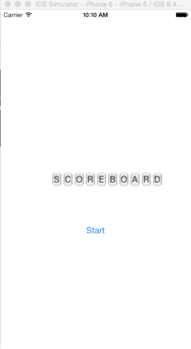

# ScoreboardLabel
A label that switches texts by animating a flip of each letter - Written in Swift, using POP

[](http://cocoapods.org/pods/ScoreboardLabel)
[](http://cocoapods.org/pods/ScoreboardLabel)
[](http://cocoapods.org/pods/ScoreboardLabel)



## Requirements

* iOS 8.0+
* xCode 6+

## Example App 

To run the example project, clone the repo, and run `pod install` from the Example directory first.


## Installation

ScoreboardLabel is available through [CocoaPods](http://cocoapods.org). To install
it, simply add the following line to your Podfile:

```objective-c
pod "ScoreboardLabel"
```

## Get Started


```objective-c
let font = aFont //any font, any size
let image = anImage //the letter backgroud image
let color = aUIColor

label = ScoreboardLabel(backgroundImage: image! ,text: "TEXT-FROM", flipToText: "TEXT-TO", font:font, textColor:color)

label.interval = Double(0.4) //each letter flip time

label.completionHandler = { (finished:Bool) in
if finished == true {
//label as finished animating
}
}

label.center = view.center

view.addSubview(label)

```

## Start Animating

```objective-c
label.flip(true) //true = flip back and forth between texts. false = flip once from text to text and thats it
```

## Stop Animating

```objective-c
label.stopFlipping() //Will stop animating after finishing current flip
```

## Collaboration
Feel free to collaborate with ideas, issues and/or pull requests.


## Author

Noam Bar-on, https://www.linkedin.com/in/noambaron

## License

The MIT License (MIT)

Copyright (c) 2015 Noam Bar-on.

Permission is hereby granted, free of charge, to any person obtaining a copy
of this software and associated documentation files (the "Software"), to deal
in the Software without restriction, including without limitation the rights
to use, copy, modify, merge, publish, distribute, sublicense, and/or sell
copies of the Software, and to permit persons to whom the Software is
furnished to do so, subject to the following conditions:

The above copyright notice and this permission notice shall be included in
all copies or substantial portions of the Software.

THE SOFTWARE IS PROVIDED "AS IS", WITHOUT WARRANTY OF ANY KIND, EXPRESS OR
IMPLIED, INCLUDING BUT NOT LIMITED TO THE WARRANTIES OF MERCHANTABILITY,
FITNESS FOR A PARTICULAR PURPOSE AND NONINFRINGEMENT. IN NO EVENT SHALL THE
AUTHORS OR COPYRIGHT HOLDERS BE LIABLE FOR ANY CLAIM, DAMAGES OR OTHER
LIABILITY, WHETHER IN AN ACTION OF CONTRACT, TORT OR OTHERWISE, ARISING FROM,
OUT OF OR IN CONNECTION WITH THE SOFTWARE OR THE USE OR OTHER DEALINGS IN
THE SOFTWARE.

<!--=======-->
<!--A label that switches texts by animating a flip of each letter - Written in Swift, using POP-->
